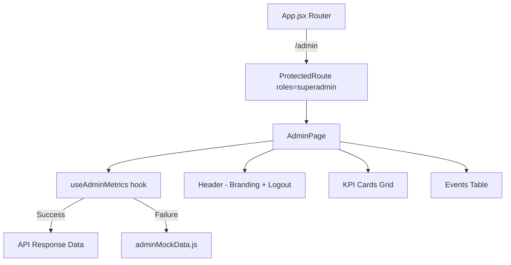

# Design Document: Admin Norware Panel

## Overview

The Admin Norware panel is a self-contained page that replaces the `DeferredRolePage` placeholder at `/admin`. It provides a platform-level metrics dashboard for the Norware superadmin, displaying KPI cards for aggregate totals and a per-event breakdown table. The panel fetches data from `GET /api/admin/metricas/` and falls back to local mock data when the API is unavailable.

The page is intentionally NOT wrapped in `OwnerShell` — it has its own lightweight header with branding and a logout button. This keeps the admin panel visually distinct from the venue owner's dashboard.

## Architecture



**Key architectural decisions:**

1. **Self-contained layout** — AdminPage renders its own header rather than using OwnerShell, matching the specification and keeping admin visually separate from venue-owner views.
2. **Custom hook for data** — `useAdminMetrics` encapsulates the fetch-with-fallback logic, making the page component focused on presentation.
3. **Existing infrastructure reuse** — Uses `api.get()` from `src/lib/api.js` for requests, `formatMoney` from `src/data/mockData.js` for currency formatting, and `ProtectedRoute` for access control.
4. **No new routing changes** — The route already exists in App.jsx with the correct `superadmin` role guard; only the rendered component changes from `DeferredRolePage` to `AdminPage`.

## Components and Interfaces

### AdminPage (`src/pages/AdminPage.jsx`)

The top-level page component. Responsibilities:
- Renders the admin header with branding and logout
- Calls `useAdminMetrics()` to get data + loading state
- Renders KPI cards grid and events table
- Handles loading and error states

```jsx
// Component structure (pseudocode)
function AdminPage() {
  const { session, logout } = useAuth()
  const { data, loading } = useAdminMetrics()

  return (
    <div className="min-h-screen bg-void bg-club-grid">
      <Header onLogout={logout} />
      {loading ? <LoadingState /> : (
        <>
          <KPIGrid totales={data.totales} />
          <EventsTable eventos={data.por_evento} />
        </>
      )}
    </div>
  )
}
```

### Header (inline in AdminPage)

A simple header bar matching the style of OwnerShell's header but with admin-specific branding:
- Left: "ADMIN NORWARE" text using `font-display`
- Right: Logout button with the same icon pattern as OwnerShell

### KPIGrid (inline in AdminPage)

Renders 4 KPI cards in a responsive grid (1 column on mobile, 2 on sm, 4 on lg):

| Card | Field | Label | Format |
|------|-------|-------|--------|
| 1 | `entradas_web_total` | Entradas Web Total | Number |
| 2 | `comision_norware_total` | Comisión Norware Total | Currency (ARS) |
| 3 | `eventos_activos` | Eventos Activos | Number |
| 4 | `eventos_cancelados` | Eventos Cancelados | Number |

Cards use the project's interface-panel styling (border, bg-floor, font-mono labels).

### EventsTable (inline in AdminPage)

A responsive table wrapped in `overflow-x-auto` for mobile horizontal scroll:

| Column | Field | Format |
|--------|-------|--------|
| Evento | `evento_nombre` | Text |
| Boliche | `boliche` | Text |
| Fecha | `fecha` | Date string |
| Estado | `estado` | Badge (strobe or door-red) |
| Entradas Web | `entradas_web` | Number |
| Comisión Norware | `comision_norware` | Currency (ARS, font-mono) |
| Recaudado Total Web | `recaudado_total_web` | Currency (ARS, font-mono) |

### useAdminMetrics (custom hook in AdminPage or extracted)

```jsx
function useAdminMetrics() {
  const [data, setData] = useState(null)
  const [loading, setLoading] = useState(true)

  useEffect(() => {
    let active = true
    api.get('/admin/metricas/')
      .then(response => { if (active) setData(response) })
      .catch(() => { if (active) setData(adminMockData) })
      .finally(() => { if (active) setLoading(false) })
    return () => { active = false }
  }, [])

  return { data, loading }
}
```

## Data Models

### API Response Shape

```typescript
interface AdminMetricsResponse {
  totales: {
    entradas_web_total: number
    comision_norware_total: number
    eventos_activos: number
    eventos_cancelados: number
  }
  por_evento: EventoMetrics[]
}

interface EventoMetrics {
  evento_id: number
  evento_nombre: string
  boliche: string
  fecha: string
  estado: 'publicado' | 'cancelado'
  entradas_web: number
  comision_norware: number
  recaudado_total_web: number
}
```

### Mock Data Shape (`src/data/adminMockData.js`)

Follows the same structure as the API response, providing realistic sample data:

```javascript
export const adminMockData = {
  totales: {
    entradas_web_total: 3420,
    comision_norware_total: 684000,
    eventos_activos: 4,
    eventos_cancelados: 1,
  },
  por_evento: [
    {
      evento_id: 1,
      evento_nombre: 'NEON PROTOCOL',
      boliche: 'NACHT',
      fecha: '2026-08-15',
      estado: 'publicado',
      entradas_web: 1245,
      comision_norware: 249000,
      recaudado_total_web: 5602500,
    },
    // ... more events
  ],
}
```

## Error Handling

| Scenario | Behavior |
|----------|----------|
| Network error (API unreachable) | Fall back to mock data silently; UI renders normally |
| API returns non-2xx status | Fall back to mock data silently; UI renders normally |
| API returns malformed JSON | `api.get()` will throw; caught by `.catch()`, falls back to mock data |
| Empty `por_evento` array | Table renders with no rows; KPI cards still show totals |
| Loading state | Show a minimal loading indicator (spinner or skeleton) with void background |

The fallback-to-mock approach matches the existing pattern in `DashboardPage.jsx` where API failures are silently handled with mock data.

## Testing Strategy

### Why Property-Based Testing Does Not Apply

This feature is primarily UI rendering and data display:
- Components receive data and render it — no complex transformations, parsing, or algorithms
- Money formatting uses the existing `formatMoney` utility (already tested implicitly)
- Status badge logic is a simple conditional (two possible values)
- The input space is small and well-defined (API response shape is fixed)

There are no universal properties that benefit from 100+ random inputs. Example-based tests with a few representative scenarios provide sufficient coverage.

### Testing Approach

**Unit Tests** (`src/pages/AdminPage.test.jsx`):

1. **Renders KPI cards with correct data** — Mount AdminPage with mocked API response, verify all 4 KPI values display correctly.
2. **Renders events table with correct columns** — Verify table headers and row data map correctly from API response.
3. **Status badge colors** — Verify "publicado" renders with strobe styling, "cancelado" with door-red styling.
4. **Loading state** — Verify loading indicator appears while data is being fetched.
5. **Mock data fallback** — Simulate API failure, verify component renders with fallback mock data.
6. **Logout button calls logout** — Verify clicking logout triggers the auth context logout function.
7. **Money formatting** — Verify monetary values display in ARS format with font-mono class.
8. **Responsive table scroll** — Verify table container has `overflow-x-auto` class.

**Testing Framework**: Vitest + React Testing Library (to be set up as a dev dependency since no test framework currently exists in package.json).

**Test Setup Requirements**:
- Install `vitest`, `@testing-library/react`, `@testing-library/jest-dom`, `jsdom`
- Mock `src/lib/api.js` to control API responses
- Mock `src/context/AuthContext.jsx` to provide session data
- Use `MemoryRouter` for routing context
