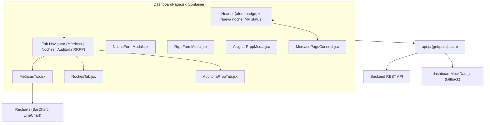
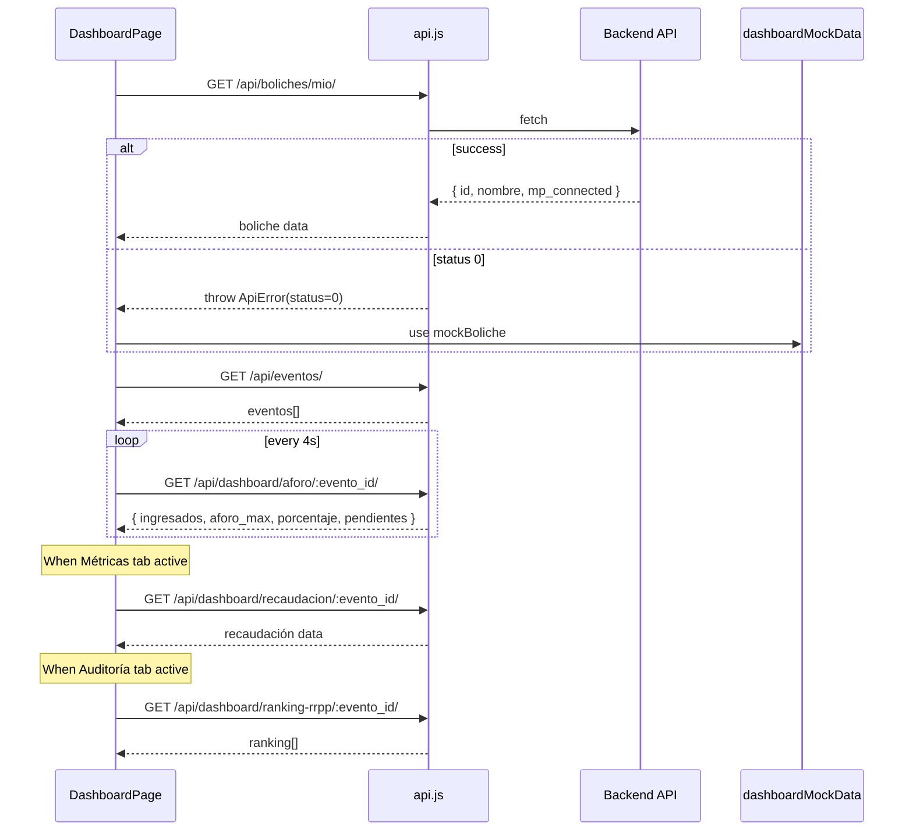

# Design Document: Dashboard Dueño

## Overview

Replace the current placeholder `DashboardPage.jsx` with a fully-featured owner dashboard implementing three tabbed views (Métricas, Noches, Auditoría RRPP), modals for event and RRPP management, Mercado Pago connection, and real-time aforo polling. The architecture follows the established patterns in the codebase — container page with local state, `api.get/post/patch` with status-0 fallback to mock data, and the existing `<Modal>` wrapper for dialogs.

## Architecture



## Main Data Flow



## Components and Interfaces

### Component 1: DashboardPage (Container)

**Purpose**: Manages global state (boliche, eventos, active tab, modal visibility), data fetching, and aforo polling. Passes data and callbacks to child components.

```javascript
// State managed by DashboardPage
const [activeTab, setActiveTab] = useState('metricas') // 'metricas' | 'noches' | 'auditoria'
const [boliche, setBoliche] = useState(null)           // { id, nombre, mp_connected }
const [eventos, setEventos] = useState([])             // array from GET /api/eventos/
const [aforo, setAforo] = useState(null)               // { ingresados, aforo_max, porcentaje, pendientes }
const [modalState, setModalState] = useState({ type: null, data: null })
// modalState.type: 'noche-create' | 'noche-edit' | 'rrpp-create' | 'rrpp-assign' | null
```

**Responsibilities**:
- Fetch boliche + eventos on mount
- Poll aforo every 4s for the first active event
- Manage which modal is open
- Pass refresh callbacks to modals so list updates after mutations

### Component 2: MetricasTab

**Purpose**: Renders 4 KPI cards and 2 Recharts charts from aggregated event/revenue data.

```javascript
// Props
interface MetricasTabProps {
  eventos: Evento[]
  recaudacion: Record<number, RecaudacionData> // keyed by evento_id
}

// KPIs computed from props
// 1. recaudación total = sum of all recaudacion[].total_recaudado
// 2. entradas vendidas = sum of all aforo ingresados
// 3. total de noches = eventos.length
// 4. promedio recaudación = total / noches
```

### Component 3: NochesTab

**Purpose**: Renders event list with estado-colored left borders and action buttons (Editar, Cancelar).

```javascript
// Props
interface NochesTabProps {
  eventos: Evento[]
  onEdit: (evento: Evento) => void
  onCancel: (eventoId: number) => void
}
```

### Component 4: AuditoriaRrppTab

**Purpose**: Renders ranked table of RRPP performance with color-coded tasa_conversion.

```javascript
// Props
interface AuditoriaRrppTabProps {
  eventoId: number | null
}
// Fetches GET /api/dashboard/ranking-rrpp/:evento_id/ internally
```

### Component 5: NocheFormModal

**Purpose**: Create/edit event form with debounced price preview.

```javascript
// Props
interface NocheFormModalProps {
  open: boolean
  onClose: () => void
  evento: Evento | null     // null = create mode, object = edit mode
  bolicheId: number
  onSuccess: () => void     // refresh event list
}
```

### Component 6: RrppFormModal

**Purpose**: Register a new RRPP staff member.

```javascript
// Props
interface RrppFormModalProps {
  open: boolean
  onClose: () => void
  onSuccess: () => void
}
```

### Component 7: AsignarRrppModal

**Purpose**: Assign an RRPP to an event, display generated links.

```javascript
// Props
interface AsignarRrppModalProps {
  open: boolean
  onClose: () => void
  eventos: Evento[]
}
```

### Component 8: MercadoPagoConnect

**Purpose**: Shows MP connection status badge in the header; triggers OAuth redirect.

```javascript
// Props
interface MercadoPagoConnectProps {
  mpConnected: boolean
}
```

## Data Models

### Evento

```javascript
{
  id: number,
  nombre: string,
  fecha: string,            // ISO datetime
  precio_base: number,
  precio_publicado: number,
  aforo_max: number,
  estado: string,           // 'publicado' | 'cancelado' | 'finalizado'
  boliche: number,
  line_up: string[],
}
```

### Estado Color Map (for NochesTab left border)

```javascript
// Event cards use left border colored by estado
function getEstadoBorderColor(estado) {
  if (estado === 'publicado') return '#8B5CF6'  // uv
  if (estado === 'cancelado') return '#E23B5A'  // door-red
  return '#8A87A3'  // muted (fallback)
}
```

### RecaudacionData

```javascript
{
  web: number,
  efectivo: number,
  transferencia: number,
  total_recaudado: number,
}
```

### RankingRrpp

```javascript
{
  id: number,
  nombre: string,
  anotados: number,
  ingresados: number,
  tasa_conversion: number,   // 0-100 percentage
  recaudado_total: number,
}
```

### PricePreview (from /api/precios/calcular/)

```javascript
{
  precio_base: number,
  fee_mp: number,
  fee_norware: number,
  precio_publicado: number,
}
```

## Key Functions with Formal Specifications

### Function: useDebouncedPricePreview (custom hook)

```javascript
function useDebouncedPricePreview(precioBase, delay = 500)
// Returns: { preview: PricePreview | null, loading: boolean }
```

**Preconditions:**
- `precioBase` is a non-negative number
- `delay` is a positive integer (defaults to 500)

**Postconditions:**
- After `delay` ms of no precioBase changes, fetches `GET /api/precios/calcular/?precio_base=X`
- Returns the latest PricePreview or null if not yet fetched
- Cancels in-flight requests when precioBase changes before debounce fires

### Function: usePollingAforo (custom hook)

```javascript
function usePollingAforo(eventoId, intervalMs = 4000)
// Returns: { aforo: AforoData | null, status: 'live' | 'demo' | 'unavailable' }
```

**Preconditions:**
- `eventoId` is a positive integer or null
- `intervalMs` is a positive integer

**Postconditions:**
- Polls `GET /api/dashboard/aforo/:evento_id/` every `intervalMs`
- On status 0, retains last successful data and marks status as 'demo'
- Cleans up interval and aborts pending requests on unmount

### Function: getConversionColor

```javascript
function getConversionColor(tasa) {
  if (tasa >= 70) return 'text-emerald-400'
  if (tasa >= 40) return 'text-amber-300'
  return 'text-door-red'
}
```

**Preconditions:**
- `tasa` is a number between 0 and 100

**Postconditions:**
- Returns a Tailwind text color class string
- Green (≥70), yellow (40–69), red (<40)

## Example Usage

```javascript
// DashboardPage.jsx — simplified structure
export default function DashboardPage() {
  const [activeTab, setActiveTab] = useState('metricas')
  const [boliche, setBoliche] = useState(null)
  const [eventos, setEventos] = useState([])
  const [modalState, setModalState] = useState({ type: null, data: null })
  const { aforo } = usePollingAforo(eventos[0]?.id)

  useEffect(() => {
    async function load() {
      try {
        const [b, e] = await Promise.all([
          api.get('/boliches/mio/'),
          api.get('/eventos/'),
        ])
        setBoliche(b)
        setEventos(e)
      } catch (err) {
        if (err.status === 0) {
          setBoliche(mockBoliche)
          setEventos(mockEventos)
        }
      }
    }
    load()
  }, [])

  return (
    <main className="container-page py-8">
      {/* Header with aforo badge, create button, MP widget */}
      {/* Tab navigator */}
      {activeTab === 'metricas' && <MetricasTab eventos={eventos} />}
      {activeTab === 'noches' && <NochesTab eventos={eventos} onEdit={...} onCancel={...} />}
      {activeTab === 'auditoria' && <AuditoriaRrppTab eventoId={eventos[0]?.id} />}
      {/* Modals */}
      <NocheFormModal open={modalState.type?.startsWith('noche')} ... />
      <RrppFormModal open={modalState.type === 'rrpp-create'} ... />
      <AsignarRrppModal open={modalState.type === 'rrpp-assign'} ... />
    </main>
  )
}
```

## Error Handling

### Network Failure (status 0)

**Condition**: `ApiError` with `status === 0` thrown from `api.get/post/patch`
**Response**: Fall back to mock data from `dashboardMockData.js`, render normally
**Recovery**: Next successful poll or manual refresh replaces mock data with live data

### API Error on Mutation (status 405)

**Condition**: PATCH or POST returns 405 (e.g., event cannot be modified/cancelled)
**Response**: Display inline error message from `error.data?.detail` inside the modal or confirmation
**Recovery**: User acknowledges, modal remains open for retry or close

### Polling Failure

**Condition**: Aforo poll request fails
**Response**: Retain last successfully fetched aforo data, continue polling
**Recovery**: Next successful poll updates the display

## Testing Strategy

### Unit Testing Approach

- Test KPI computation logic (sum, average calculations)
- Test `getConversionColor` function with boundary values (39, 40, 69, 70)
- Test debounce behavior for price preview

### Integration Testing Approach

- Verify tab switching renders correct content
- Verify modal open/close lifecycle
- Verify API fallback to mock data on network error
- Verify aforo polling starts and stops correctly

## Performance Considerations

- Debounce price preview API calls (500ms) to avoid excessive requests during typing
- Aforo polling at 4s is adequate for near-real-time without overloading
- Tab content is conditionally rendered (not mounted when inactive) to avoid unnecessary Recharts re-renders
- `useMemo` for KPI calculations to prevent recomputation on unrelated state changes

## Dependencies

- `recharts` — bar and line chart rendering (new dependency to install)
- `react`, `react-dom`, `react-router-dom` — existing
- `tailwindcss` — existing styling system
- Existing project utilities: `api.js`, `Modal.jsx`, `Icons.jsx`, `AuthContext`

## Correctness Properties

*A property is a characteristic or behavior that should hold true across all valid executions of a system — essentially, a formal statement about what the system should do. Properties serve as the bridge between human-readable specifications and machine-verifiable correctness guarantees.*

### Property 1: KPI computation consistency

*For any* set of recaudación values across N events, the "promedio de recaudación por noche" KPI shall equal the sum of all `total_recaudado` values divided by N (the count of events).

**Validates: Requirement 2.1**

### Property 2: Estado border color mapping

*For any* event with estado "publicado", the rendered event card shall have a left border with `uv` color (#8B5CF6). For estado "cancelado", it shall use `door-red` (#E23B5A).

**Validates: Requirement 3.2**

### Property 3: Conversion color thresholds

*For any* `tasa_conversion` value between 0 and 100, `getConversionColor` shall return green for values ≥ 70, yellow for values in [40, 70), and red for values < 40.

**Validates: Requirement 5.3**

### Property 4: RRPP ranking sort order

*For any* array of RRPP ranking entries, the displayed table shall be sorted by `recaudado_total` in strictly descending order (each row's value ≥ next row's value).

**Validates: Requirement 5.4**

### Property 5: Debounce coalesces rapid changes

*For any* sequence of N precio_base changes occurring within 500ms, the price preview API shall be called at most once (with the final value), not N times.

**Validates: Requirement 4.2**

### Property 6: Polling resilience preserves last data

*For any* sequence of aforo poll responses where some fail (status 0), the displayed aforo data shall always equal the last successfully received response, never null or stale from a prior event.

**Validates: Requirement 9.4**

### Property 7: Form validation rejects incomplete submissions

*For any* combination of required form fields where at least one field is empty, the Noche form submission shall be prevented and the empty fields shall be highlighted as invalid.

**Validates: Requirements 4.5, 6.3**
