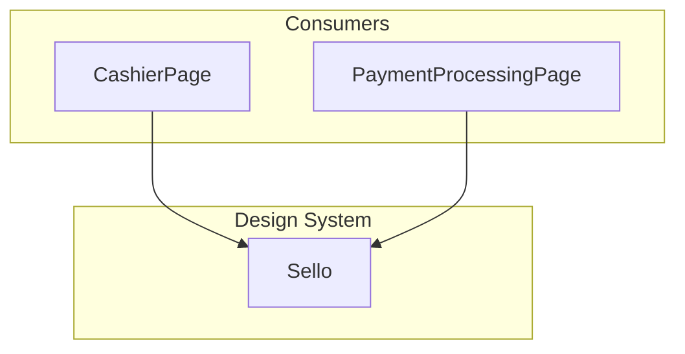

# Design Document: Design System (Sello Component)

## Overview

This feature introduces the reusable `<Sello />` presentational React component to the Norware nightclub ticketing frontend. `Sello` renders an SVG irregular octagon stamp representing transaction/ticket status. It follows the "physical object" design rule (`border-radius: 0`) and uses the `font-mono` design token.

## Architecture



The Sello component is a leaf-level presentational component with no internal state, no side effects, and no external dependencies beyond React.

## Components and Interfaces

### Component: Sello

**Purpose**: Renders an SVG stamp/seal with rotation, color, and text driven by an `estado` prop.

```jsx
// Props interface
interface SelloProps {
  estado: string       // Status identifier (e.g. "aprobado_guardia")
  size?: 'sm' | 'md' | 'lg'  // Defaults to 'md'
  texto?: string       // Override display text
  animate?: boolean    // Apply pulse-seal animation
  className?: string   // Optional additional CSS classes
}
```

**Responsibilities**:
- Look up rotation, stroke color, and default text from `SELLO_CONFIG`
- Render SVG irregular octagon path with stroke-only style
- Apply rotation transform to the SVG group
- Size the SVG according to the `size` prop
- Conditionally apply `animate-pulse-seal` class
- Render centered text inside the octagon

## Data Models

### SELLO_CONFIG Map

```javascript
export const SELLO_CONFIG = {
  aprobado_guardia: { color: '#8B5CF6', rotation: -4, defaultText: 'APROBADO' },
  rebotado_guardia: { color: '#E23B5A', rotation: 3, defaultText: 'REBOTADO' },
  ingresado_final: { color: '#22D3EE', rotation: -2, defaultText: 'INGRESADO' },
  ingresado: { color: '#8B5CF6', rotation: -2, defaultText: 'INGRESADO' },
  cancelado: { color: '#E23B5A', rotation: 5, defaultText: 'CANCELADO' },
  procesando: { color: '#8A87A3', rotation: -3, defaultText: 'PROCESANDO' },
}

export const SELLO_SIZES = { sm: 80, md: 128, lg: 180 }
```

### SVG Path

```
M 15 5 L 85 8 L 95 20 L 92 80 L 82 95 L 18 92 L 5 82 L 8 18 Z
```

An irregular octagon (8 vertices, slightly asymmetric) simulating a hand-stamped look within a `viewBox="0 0 100 100"`.

## Key Functions with Formal Specifications

### Function: getSelloConfig(estado)

```javascript
function getSelloConfig(estado) {
  return SELLO_CONFIG[estado] ?? { color: '#8A87A3', rotation: 0, defaultText: '' }
}
```

**Preconditions:**
- `estado` is a string

**Postconditions:**
- Returns an object with `color`, `rotation`, and `defaultText` properties
- If `estado` matches a key in `SELLO_CONFIG`, returns that config
- Otherwise returns a neutral fallback

### Function: getSelloSize(size)

```javascript
function getSelloSize(size) {
  return SELLO_SIZES[size] ?? SELLO_SIZES.md
}
```

**Preconditions:**
- `size` is 'sm', 'md', 'lg', or undefined

**Postconditions:**
- Returns a number (pixel dimension)
- Defaults to `SELLO_SIZES.md` (128) for undefined/unknown values

## Example Usage

```jsx
import { Sello } from '../components/Sello'

<Sello estado="aprobado_guardia" size="lg" animate />
// Renders: large purple stamp rotated -4deg with "APROBADO", pulsing

<Sello estado="cancelado" size="sm" texto="RECHAZADO" />
// Renders: small red stamp rotated 5deg with custom text "RECHAZADO"

<Sello estado="procesando" />
// Renders: medium gray stamp rotated -3deg with "PROCESANDO"
```

## Error Handling

### Unknown Sello Estado

**Condition**: `estado` prop is not in `SELLO_CONFIG`
**Response**: Render with neutral muted color, 0 rotation, and empty text
**Recovery**: No error thrown; component renders a neutral stamp

## Testing Strategy

### Unit Testing Approach

Use Vitest + React Testing Library (RTL) for unit tests:
- Verify Sello renders SVG with correct rotation and stroke color per estado
- Verify Sello renders at correct dimensions for each size
- Verify Sello animation class toggling
- Verify custom texto prop overrides default label

## Performance Considerations

The Sello component is a pure presentational component with no state, effects, or network calls. Performance impact is negligible. The only dynamic values are inline styles for the SVG transform, which avoid Tailwind's JIT limitations with dynamic values.

## Dependencies

- **react**: Rendering framework (already installed)
- **vitest**: Test runner (from testing-infrastructure spec)
- **@testing-library/react**: Component testing (from testing-infrastructure spec)
- **@testing-library/jest-dom**: DOM matchers (from testing-infrastructure spec)
- **jsdom**: DOM environment for Vitest (from testing-infrastructure spec)

## Correctness Properties

### Property 1: Sello config totality

*For any* string input to the Sello `estado` prop, `getSelloConfig` SHALL always return an object containing a numeric `rotation`, a valid hex `color` string, and a string `defaultText`.

**Validates: Requirements 1.1, 1.2, 1.3**

### Property 2: Sello text resolution

*For any* valid estado, when a `texto` prop is provided, the rendered stamp text SHALL equal that `texto` value uppercased; when no `texto` is provided, it SHALL equal the `defaultText` from the config.

**Validates: Requirements 1.5, 1.6**

### Property 3: Sello size mapping

*For any* value of the `size` prop in `['sm', 'md', 'lg']`, the rendered SVG width and height attributes SHALL equal the pixel value defined in `SELLO_SIZES` for that key.

**Validates: Requirements 2.1, 2.2, 2.3**

### Property 4: Sello animation toggle

*For any* estado and size combination, the `animate-pulse-seal` CSS class SHALL be present on the component if and only if the `animate` prop is `true`.

**Validates: Requirements 2.5, 2.6**
